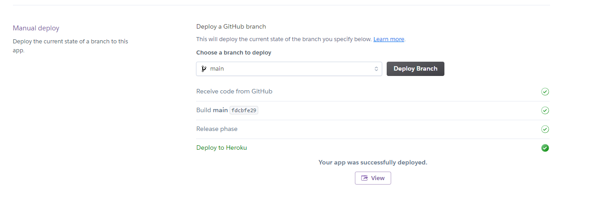
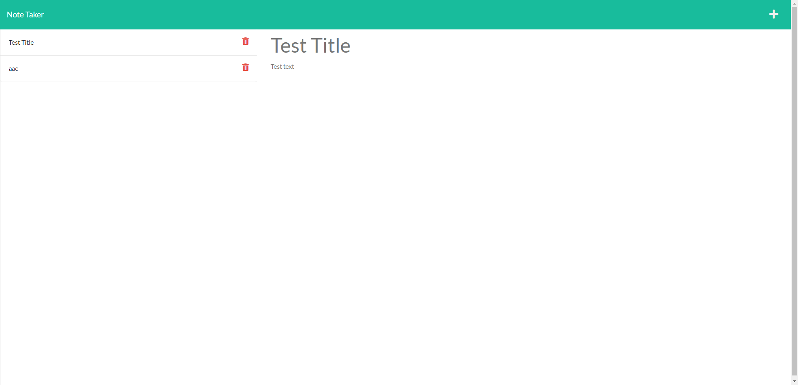
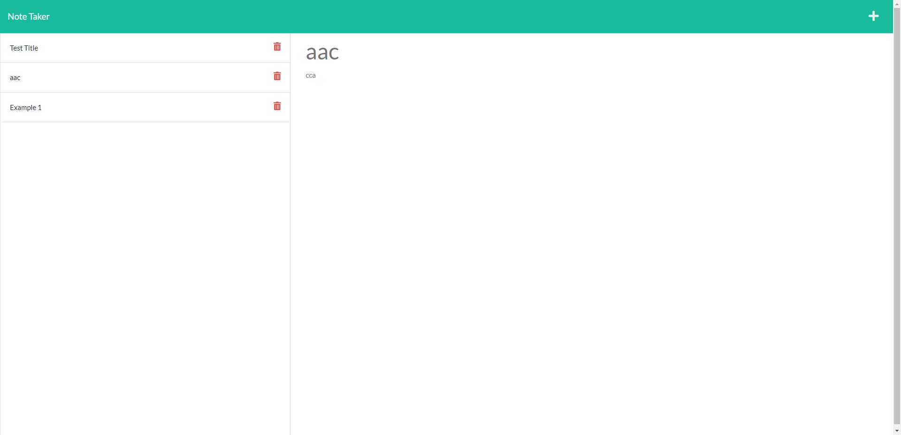

# UCSD_HW11_Note-Taker
This program  is to modify starter code to create an application called Note Taker that can be used to write and save notes. This application will use an Express.js back end and will save and retrieve note data from a JSON file.

## User Story

```
AS A small business owner
I WANT to be able to write and save notes
SO THAT I can organize my thoughts and keep track of tasks I need to complete
```

## Related Link

* The deployed link to heroku: https://hwnotes.herokuapp.com/
    But due the the region, I could not open this link by my-self, where I could only see the result "Your app was successfully deployed.".

* The Github repository link: https://github.com/hengyu89/UCSD_HW11_Note-Taker

* If screenshot doesn't work, here is the video to represent all works: https://www.youtube.com/watch?v=xA0WqRNo62s

## Usage

* Javascript
* HTML
* Package: fs, express, path...

## What I've done

* Due to the completeness from js, css and html parts. I constructed the program with server part to connect the back and front end. Finish the back end. And deployed these works into Heroku.

## Screenshot:



The screenshot to show note screen.



The screenshot to show note added successfully, and could see history notes.

